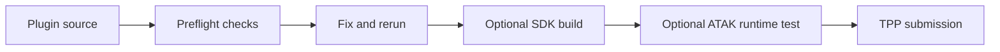

# ATAK Plugin Preflight

**Find source-code problems before sending an ATAK plugin to the Third Party
Pipeline (TPP).**

An agent-first, source-first pre-flight runner for ATAK plugin authors. It
produces a terminal summary, machine-readable receipt, HTML report, retained
scanner output, and SHA-256 source evidence.

[](https://github.com/joshuafuller/atak-plugin-preflight/actions/workflows/self-test.yml)
[](LICENSE)
[](https://www.python.org/)
[](Dockerfile)
[](docs/knowledge-base.md)

> [!IMPORTANT]
> This project does not sign APKs, require TPP credentials, upload to TAK.gov,
> or claim to reproduce Fortify. It helps you find and fix likely problems
> before the private pipeline review.

> [!CAUTION]
> This is an early, evolving tool. Treat its report as pre-flight evidence and
> review security findings before shipping.

## Relationship to TAK

This is an independent, unofficial developer aid. It is not produced by,
endorsed by, sponsored by, or affiliated with the TAK Product Center, TAK.gov,
the United States Government, or the TPP. It does not provide access to TAK
software, SDKs, signing keys, or pipeline services.

For official information, use [TAK.gov](https://tak.gov/), the official
[TAK.gov third-party signing information](https://tak.gov/pages/our-process), the
[authenticated TPP user-builds portal](https://tak.gov/user_builds), and the
[official SDK information](https://tak.gov/pages/sdks). The user-builds portal
requires a TAK.gov login. TAK and related product names, logos, software,
documentation, and marks remain the property of their respective owners. All
rights reserved by those owners. This repository claims no ownership of them.

> [!WARNING]
> Follow the official licensing, export-control, authorization, operational,
> and security requirements that apply to the TAK products and environment you
> use. This repository does not change those requirements.

## Start here

### Run locally

```sh
python3 preflight.py path/to/my-plugin
```

Use `--json` when another agent or CI needs a machine-readable result. It emits
JSON only; the same receipt is also saved under the report directory.

The report is written to:

```text
reports/preflight-YYYYMMDD-HHMMSS-microseconds/
```

### Run with Docker

Docker pins the open-source scanner versions so different machines get the
same local checks.

```sh
ATAK_PLUGIN_SOURCE=/absolute/path/to/my-plugin \
  docker compose run --rm preflight
```

### Add to GitHub Actions

Copy [`templates/github-actions/atak-plugin-preflight.yml`](templates/github-actions/atak-plugin-preflight.yml)
and `preflight.py` into the plugin repository. The workflow runs on pushes and
pull requests and uploads the report as an artifact.

> [!NOTE]
> The ATAK SDK is not included. Download the required SDK from
> [tak.gov](https://tak.gov/) yourself and keep it outside public source
> control. See the [SDK handoff guide](docs/sdk.md) for the expected locations.
> No TPP credentials or signing key are needed for these checks.

## What it checks

| Area | Examples |
| --- | --- |
| Project shape | Gradle files, Android module, source manifest |
| ATAK metadata | `plugin-api` or `atakApiVersion` references |
| Source SAST | Semgrep with the repository-owned baseline rules |
| Dependencies and secrets | OSV-Scanner and Trivy when installed |
| Evidence | Source inventory, hashes, JSON receipt, HTML report, raw scan output |

## Result meanings

| Result | Meaning | Action |
| --- | --- | --- |
| `PASS` | The local check completed without a reported issue | Continue, then review the evidence |
| `FAIL` | A tool found an issue or a required project check failed | Fix it and rerun |
| `WARN` | Review is needed, but the check cannot decide automatically | Inspect the source or merged manifest |
| `GAP` | A required local tool or external proof is unavailable | Install the tool or record the external follow-up |

> [!WARNING]
> A `GAP` makes the default run non-clean. Use `--allow-gaps` only when you
> deliberately want a partial exploratory run.

## What “clean” does and does not mean

A clean run means the required local checks ran, found no unexplained failure,
and recorded the scanned source state. It does not prove:

- Fortify will produce zero findings;
- TPP will accept or sign the package;
- the plugin works on every ATAK release or variant;
- the release obfuscation mapping and signing rules are satisfied; or
- an untested runtime, device, network, or user journey works.

## Recommended path



1. Point preflight at the plugin source repository.
2. Fix every `FAIL`, and resolve every unexplained `WARN` or `GAP`.
3. Build locally against the intended ATAK SDK if needed.
4. Test the important user journey on the exact ATAK runtime.
5. Submit to TPP with the local report and source hash.

## Documentation

- [Beginner workflow](docs/workflow.md) — the complete path from source to TPP.
- [GitHub Actions CI](docs/ci.md) — copy the ready-to-run workflow into your
  own plugin repository.
- [ATAK SDK handoff](docs/sdk.md) — where the agent expects a user-downloaded
  SDK and how to configure it.
- [Knowledge base](docs/knowledge-base.md) — ATAK compatibility, TPP observations,
  Fortify finding triage, and evidence boundaries.
- [TPP pipeline map](docs/tpp-pipeline.md) — what we can reproduce locally and
  where the evidence stops.
- [Project context](CONTEXT.md) — canonical terms and project boundaries.

## Development

```sh
python3 -m unittest discover -s tests -v
python3 preflight.py --help
```

The repository's own CI runs these checks on every push and pull request.
