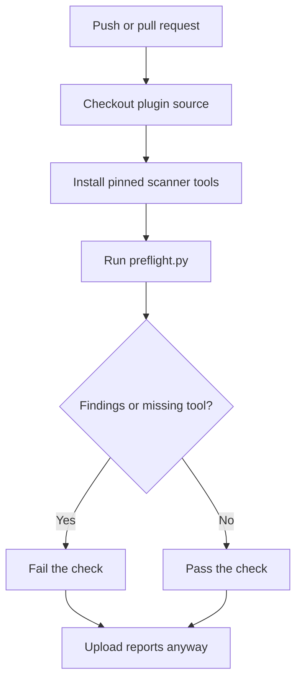

# GitHub Actions CI

Use the provided workflow to run the same source pre-flight on every push and
pull request in an ATAK plugin repository.

> [!IMPORTANT]
> This workflow scans plugin source. It does not download the restricted ATAK
> SDK, build a release APK, sign an artifact, contact TPP, or need TPP secrets.

> [!NOTE]
> This is an unofficial community tool. See the README's [relationship to
> TAK](../README.md#relationship-to-tak) statement and follow the official
> requirements published by [TAK.gov](https://tak.gov/).

When you are ready to submit an APK for Third Party Pipeline signing, use the
authenticated [TPP user-builds portal](https://tak.gov/user_builds). It requires
a TAK.gov login; this CI workflow does not access it.

## Add it to an existing plugin repository

From the root of your plugin repository:

```text
your-plugin/
├── .github/
│   └── workflows/
│       └── atak-plugin-preflight.yml
├── preflight.py
├── app/
└── ...
```

Copy these two files from this repository:

1. [`preflight.py`](../preflight.py) to the root of your plugin repository.
2. [`atak-plugin-preflight.yml`](../templates/github-actions/atak-plugin-preflight.yml)
   to `.github/workflows/atak-plugin-preflight.yml`.

Then commit and push:

```sh
git add preflight.py .github/workflows/atak-plugin-preflight.yml
git commit -m "ci: add ATAK plugin preflight"
git push
```

GitHub will show the run under the repository's **Actions** tab. Pull requests
also receive a check that can be required by branch protection.

## What the workflow does



The workflow:

- checks out the repository;
- installs Python 3.12, Semgrep, Trivy, and OSV-Scanner;
- runs `python preflight.py . --json`;
- fails when a required project check, scanner, or finding blocks a clean run;
- uploads `reports/` even when the check fails.

The scanner versions are pinned in the template. Review and update those pins
deliberately; a scanner update can change findings.

## Reading the result

Open the completed workflow run and download the `atak-source-preflight`
artifact. It contains:

| File | Use |
| --- | --- |
| `receipt.json` | Machine-readable status, finding levels, source inventory, and hashes |
| `report.html` | Human-readable review report |
| `scans/semgrep.json` | Semgrep findings and rule data |
| `scans/trivy.json` | Trivy vulnerability, secret, and misconfiguration output |
| `scans/osv.json` | OSV dependency scan output |
| `scans/*.log` | Tool stderr and execution details |

> [!WARNING]
> A passing GitHub check means the configured local checks passed for the
> checked-out commit. It does not prove Fortify will be clean, that ATAK will
> load the plugin, or that TPP will accept it.

## Repository permissions

The template requests only:

```yaml
permissions:
  contents: read
```

It does not need custom secrets, an ATAK SDK secret, or signing credentials.

## Updating the copied runner

The copied `preflight.py` is intentionally local to the plugin repository. It
keeps builds reproducible even if this helper repository changes. To pick up
improvements, compare the upstream file, review the diff, and update it as a
normal source change. Do not blindly replace a locally modified runner.

## When CI should not be the only check

Run the local Docker or native preflight before opening a pull request when
possible. Use the restricted ATAK SDK and a host-connected emulator separately
when you need build or runtime evidence. Keep those SDKs and emulator images
out of public repository history.
