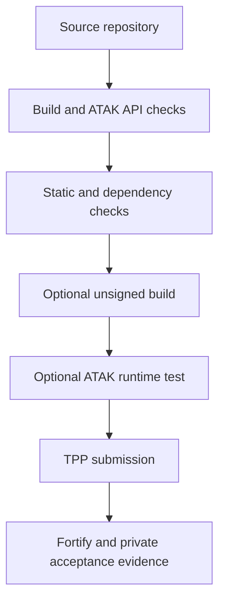
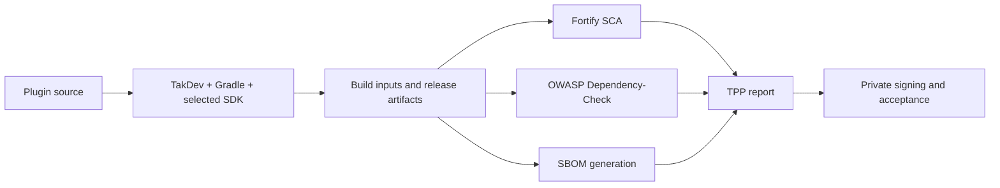

# ATAK plugin pre-flight knowledge base

> [!IMPORTANT]
> This knowledge base records what local checks can establish and where their
> evidence stops. It is a pre-flight guide, not a TPP acceptance guarantee.

This is the working knowledge behind the checks. It is deliberately written
for an author or an agent that may have no prior ATAK plugin experience.

## The real question

The useful question before TPP is not “did a scanner return zero?” It is:

> What code, build input, or runtime behavior can still surprise the TPP review,
> and what is the cheapest evidence we can collect about it now?

The evidence ladder is:



Each step narrows risk, but does not inherit the authority of the next step.
For example, a clean source scan is useful evidence that the scanned source had
no matching rules; it is not evidence that a release ATAK runtime will load the
plugin.

## ATAK compatibility rules

> [!WARNING]
> API version, variant, obfuscation mapping, and signing are separate gates.
> Passing one does not compensate for a mismatch in another.

The plugin compatibility guidance identifies four independent gates. All of
them must be satisfied for a plugin to load:

1. **API runtime version.** The plugin and ATAK runtime must share the same API
   version. In the template build, this is selected by `ATAK_VERSION`. The
   merged manifest contains metadata shaped like:

   ```text
   com.atakmap.app@<version>.<variant>
   ```

   Example: `com.atakmap.app@5.6.0.CIV`.

2. **Variant.** The Gradle build variant/flavor determines the ATAK variant the
   plugin targets. Since 4.2, CIV plugins may run in any ATAK variant, while a
   plugin built for a specific variant is restricted to that variant. Older
   ATAK releases had stricter variant matching. This rule does not remove the
   API, mapping, or signing gates.

3. **Obfuscation mapping.** Release ATAK applications use obfuscated source.
   The plugin must be compatible with the matching ATAK obfuscation mapping.
   A plugin that works against a development SDK build is not automatically
   proven compatible with a production ATAK build.

4. **Signing key.** Release ATAK enforces plugin signing-key whitelisting. The
   SDK signing behavior and release behavior are different, so a locally built
   unsigned/debug APK can prove compilation or limited runtime behavior but not
   release signing acceptance.

When compatibility is unclear, inspect ATAK’s About screen for the available
Plugin API and use Package Management’s Details screen for the plugin-side
reason. Do not infer compatibility from the filename or from `minSdk` alone.

## What the Third Party Pipeline (TPP) appears to do

Our returned bundle is evidence about one observed submission, not a guaranteed
description of the private TAK.gov implementation. It showed a build phase,
Fortify source analysis, dependency analysis, SBOM generation, and returned
artifacts/mappings.



The returned files included a build log, Fortify logs and FPR/PDF results,
Dependency-Check HTML, SBOM JSON/XML, an APK/AAB, and an R8 mapping. A key
lesson is that Dependency-Check can report a build-time AAR/JAR even when its
classes are not packaged into the final plugin. The local report must preserve
that distinction instead of silently calling every dependency a shipped
runtime dependency.

The earlier ARACHNE `0.0.1-alpha2` bundle was also a provenance warning: the
returned APK was built from an earlier source state than the later remediation
commits. A finding in that report cannot by itself describe the current source.
Always record source hash, build inputs, artifact hash, and scan timestamp
together.

## How to approximate the pipeline locally

| TPP concern | Local check | Evidence ceiling |
| --- | --- | --- |
| Gradle/TakDev build | Plugin wrapper plus the author-provided ATAK SDK | This source can build against that SDK and variant |
| Manifest/API metadata | Source manifest and, when available, merged manifest inspection | Declared metadata is visible; runtime still has to agree |
| Fortify source SAST | Semgrep with the repository-owned baseline rules | Matching source patterns; not Fortify parity |
| Dependency advisories | OSV-Scanner, Trivy, and optionally OWASP Dependency-Check | Recognized coordinates and files; no-lockfile projects still have limited coverage |
| SBOM/provenance | Syft or the package manager’s dependency report | Inventory generated by that tool, not TPP’s exact inventory |
| Runtime behavior | ADB plus UIAutomator on an exact ATAK image | Only the tested device/API/variant/network/scenario |
| Release acceptance | No local replacement | TPP/TAK.gov decision only |

No TPP credentials or signing key are required for this repository. Users must
download any restricted ATAK SDK from tak.gov themselves and keep it outside
the public repository. Docker makes scanner versions repeatable; it does not
make the SDK public or eliminate the need for a host-connected emulator.

## Lessons from the returned Fortify report

> [!TIP]
> Treat a scanner finding as a lead to investigate. Confirm the data flow and
> the value's real use before changing security-sensitive code.

The report contained categories that are worth making explicit in local triage:

- TLS identity and weak TLS configuration: determine whether the code is a
  client, server, or test fixture. Require modern TLS and proper certificate
  verification; do not disable verification merely to silence a finding.
- XML external entity and expansion behavior: configure parsers safely, reject
  unsafe input, and confirm the chosen parser actually supports the requested
  hardening properties. A property that throws “unsupported” is not a fix.
- Weak hashes: distinguish passwords, signatures, integrity checks, cache keys,
  and display fingerprints. SHA-256 is not a password-storage replacement for a
  dedicated password KDF, and replacing every digest blindly can break valid
  integrity behavior.
- Password or secret comments: verify that the comment is not exposing a real
  credential, then remove stale instructions and scan history/configuration.
- Dependency vulnerabilities: locate the vulnerable coordinate, determine if
  it is build-only or packaged, and still update or document it. “Not shipped”
  may reduce runtime impact but does not make a build pipeline finding vanish.

The local agent should show the exact file and line, explain the likely data
flow, ask what the value is used for, and recommend the smallest safe fix. It
should not rewrite security code mechanically without understanding that use.

## Agent operating rules

An agent using this repository should:

1. Locate the source repository before looking at an APK.
2. Detect the Gradle wrapper, SDK/API target, variants, manifests, lockfiles,
   generated code, and available tools.
3. Run fast source checks first and preserve raw output, tool versions, hashes,
   and timestamps.
4. Report the first actionable failure clearly, while retaining all raw scan
   results for later triage.
5. Treat `GAP` as unfinished evidence, not as `PASS`.
6. Separate `verified`, `inferred`, and `external-required` statements.
7. Never print credentials, signing material, or private SDK contents.
8. Re-run after each remediation and compare source/report hashes so an old
   scan cannot be mistaken for a scan of the fixed source.

## Representative public test subject

The public TAK-MESHCORE plugin was useful as a smoke-test subject because it is
an actual maintained ATAK plugin with a Gradle wrapper and ATAK SDK metadata.
Running this preflight against it produced a useful non-green result:

```text
source/project shape: PASS
Semgrep: FAIL — 2 exported Android components require review
Trivy: PASS — no findings in the scanned source tree
OSV-Scanner: GAP — tool unavailable in that environment
```

That is the intended behavior: a real project yielded actionable source review
items and an explicit missing-tool gap, rather than a misleading “all clear.”

## What a clean result means

> [!CAUTION]
> “Clean” is a statement about the checks that actually ran locally. It is not
> a prediction that Fortify or TPP will return zero findings.

“Clean” means every required local check ran, produced no unexplained failure,
and the source/build state was recorded. It does not mean:

- Fortify will produce zero findings;
- TPP will accept or sign the package;
- the plugin works on every ATAK version from 5.6 onward;
- a CIV build is interchangeable with every MIL or release build; or
- a runtime/network test covered scenarios that were not exercised.

That boundary is the product: reduce avoidable TPP surprises without making a
claim the local evidence cannot support.
