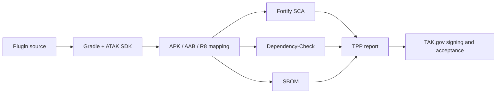
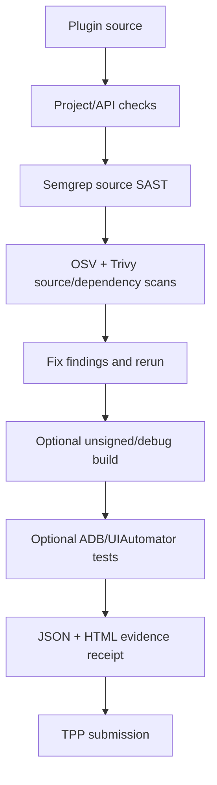
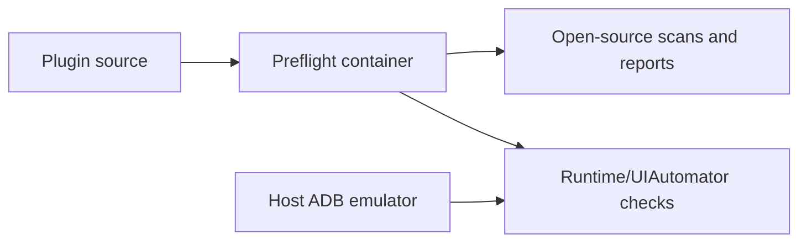

# Third Party Pipeline (TPP) map

> [!NOTE]
> This is an evidence-based working model from a returned TPP bundle. TAK.gov's
> private implementation, rules, and tool versions may differ.

The official authenticated submission entry point is the [TAK.gov user-builds
portal](https://tak.gov/user_builds). The [public process page](https://tak.gov/pages/our-process)
explains the pipeline at a high level.

This describes the observable signing/submission process from a returned TPP
bundle. It is a working model, not a claim about TAK.gov's private
implementation. File names and tool versions can change.

## Pipeline at a glance



This repository focuses on the source-fault portion before TPP. It does not
sign or produce a release APK. A local unsigned/debug build and ATAK runtime
test are separate optional checks after source preflight.

The compatibility rules and triage guidance behind this map are collected in
the [knowledge base](knowledge-base.md). The short version is: API version,
variant, obfuscation mapping, and signing requirements are separate gates.



## What the returned bundle shows

The bundle we inspected contained:

1. `build.log` — a Gradle build using the ATAK TakDev plugin, a selected
   `devkitVersion`, `production=true`, API/mapping/core-rule inputs, and a CIV
   release APK/AAB build.
2. `fortify_analyze.log` and `fortify_scan.txt` — Fortify SCA source analysis,
   configuration analysis, and result rendering.
3. `scan_results.fpr` and `fortify_scan_results.pdf` — Fortify's raw project
   results and human report, including source locations, categories, severity,
   and Fortify issue details.
4. `dependency-check-report.html` — OWASP Dependency-Check over build and
   packaged artifacts, with NVD/CPE evidence and CVEs.
5. `sbom/bom.json` and `sbom/bom.xml` — a software bill of materials.
6. `app-civ-release.apk`, `app-civ-release.aab`, and the R8 mapping — the
   artifacts and mapping associated with the scan.

The important lesson is that TPP scans more than the final APK. Build-time
Gradle/AAR/JAR artifacts can appear in Dependency-Check even when their classes
are not shipped in the application.

## Local open-source equivalent

| Observable TPP stage | Local equivalent | What it proves |
| --- | --- | --- |
| TakDev/Gradle release build | The plugin's Gradle wrapper and declared ATAK SDK | The project builds for the selected SDK and variant |
| Manifest/package inspection | Android Build Tools `aapt2` | Package, version, SDK levels, and plugin metadata |
| Source SAST | Semgrep with the repository-owned baseline rules | Pattern findings in scanned source |
| Dependency advisories | OSV-Scanner over lockfiles; OWASP Dependency-Check when installed | Known advisories for recognized package coordinates |
| Secrets/configuration | Trivy filesystem scan | Recognized secrets, vulnerabilities, and misconfigurations |
| Runtime behavior | ADB emulator/device tests and UIAutomator | Behavior on that exact Android/ATAK setup |
| Fortify SCA | No complete open-source replacement | Fortify-specific taint/call-flow rules and Fortify IDs |
| TPP acceptance | No local replacement | TAK.gov signing, whitelist, service policy, and acceptance |

## Recommended local sequence

An agent should execute the cheap, deterministic checks first and stop at the
first actionable failure:

```text
locate source repository
  -> inspect Gradle, manifest, ATAK API target, and tool availability
  -> run Semgrep source SAST
  -> run OSV and Trivy source/dependency scans
  -> build from source for the target ATAK SDK
  -> scan lockfiles and Gradle/AAR/JAR inputs for advisories
  -> run emulator/runtime tests
  -> produce one evidence receipt
  -> submit to TPP only when local findings are understood
```

The agent must label each statement as `verified`, `inferred`, or
`external-required`. For example, a clean Semgrep result can be verified
locally; “ATAK will load it” requires the target ATAK runtime; “TPP will accept
it” is external-required.

## Known replication gaps

> [!WARNING]
> Open-source checks improve the pre-flight signal; they do not create Fortify
> equivalence or guarantee ATAK runtime compatibility.

- Fortify's proprietary control-flow and taint modeling is not reproduced by
  Semgrep, Trivy, OSV-Scanner, or Syft.
- OSS tools may miss Gradle plugin and AAR/JAR components unless those build
  inputs are explicitly inventoried and scanned.
- A passing emulator test covers the tested image, API level, ATAK variant,
  network, and scenario only. It is not universal compatibility evidence.
- A clean local report is a pre-flight signal, not a TPP acceptance result.

## Container boundary



The Docker image pins the open-source scanner versions and contains no ATAK
SDK or user source by default. The current container runs source scans only;
it does not perform the Gradle stage. Users download any required SDK from
tak.gov themselves and use it read-only in the plugin's documented build
environment. No TPP credentials or signing key are needed for local preflight
because it does not sign an APK.
Emulator testing remains host-connected because Android emulators and ADB are
more reliable outside a generic scanner container; the container can still
produce the test command and consume its receipt.
